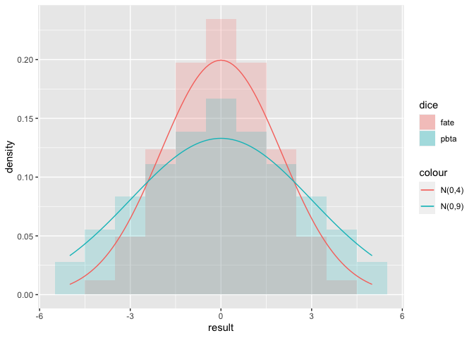

Roleplaying Game Dice: Statistics and Gameplay
================

## Agency and Experience

About five years ago, I won a contest from [Evil Hat
Productions](https://www.evilhat.com/home/) as part of the Evil Hat
Street team. My prize was an hour long conversation with members of the
Evil Hat team on a subject of my choosing. To be honest, I was not
terribly interested in the conversation at the time (I wanted the
tangible goodies from the other prizes). But my friend
[John](https://github.com/owendl/rpgaday2020/blob/master/29-ride-DO.md)
and I got on a call with Sean Nittner and Fred Hicks to discuss game
design.

In our conversation, Sean brought up the balance of agency versus
experience in roleplaying games. To summarize, agency decscribes the
control the players have over their characters destiny. Games with high
agency have players as competent characters taking proactive actions and
changing the world around them. By contrast experience is the world of
the game imposing its will on the characters. A game with high
experience (and conversly low agency), the characters are relative
nobodies, trying just to survive with no grand designs.

## Drama and Dice

### Apocalypse World

Powered by the Apocalypse games (PbtA) utilize a dice mechanic first
popularized by the game Apocalypse World by Vincent Baker. The governing
dice mechanic could not be any simpler, roll two six-sided dice (2d6)
and add a stat, typically ranging from -1 to 2. A 6 or lower (6-) is a
failure, 7-9 is a partial success and a 10+ is a full success. What is a
success and variations thereof can change game to game but the core
mechanic stays the
same.

|     2 |     3 |     4 |     5 |     6 |     7 |     8 |     9 |    10 |    11 |    12 |
| ----: | ----: | ----: | ----: | ----: | ----: | ----: | ----: | ----: | ----: | ----: |
| 0.028 | 0.056 | 0.083 | 0.111 | 0.139 | 0.167 | 0.139 | 0.111 | 0.083 | 0.056 | 0.028 |

Frequency of Results of 2d6

### Fate

The Fate roleplaying system builds off of the FUDGE roleplaying system
dice mechanic, where four FUDGE/Fate dice (4df) are rolled and then the
combined results are totaled. These dice are also six-sided but two
faces are blank (0), two have a “-” sign (-1) and two faces have a “+”
sign (+1). Thus the range of values for a 4df roll is -4 to 4. Beyond
the dice themselves, players add skills to the rolls, typically ranging
from 0 to
5.

|   \-4 |   \-3 |   \-2 |   \-1 |     0 |     1 |     2 |     3 |     4 |
| ----: | ----: | ----: | ----: | ----: | ----: | ----: | ----: | ----: |
| 0.012 | 0.049 | 0.123 | 0.198 | 0.235 | 0.198 | 0.123 | 0.049 | 0.012 |

Frequency of Results of 4df

### Comparing Different Dice

<!-- -->

The two additional lines are of two normal distributions
\(N(0,4), N(0,9)\). These provide rough estimations of the distributions
of the two different dice mechanics.

Some observatons of the data: \* The variance of PbtA dice is almost
twice that of the Fate dice if using the comparable normal distributions
\* 63% of Fate dice rolls are -1, 0 or 1, or essentially the same as the
underlying skill. \* 42% of PbtA rolls are a failure on the dice (6-) \*
42% of PbtA rolls are only a partial success on the dice (7-9)

### Agency and Experience: a personal thoughts

In Fate games, the outcomes are more predictable, the dice clustering
around zero. Extreme results are possible but very unlikely. Powered by
the Apocalypse games have a flatter spread, extreme results entering the
realm of plausible. And failure is guaranteed almost half of the time.

I remember thinking during our conversatoin with Fred and Sean that I
play Fate for the agency and Powered by the Apocalypse games for the
experience. I didn’t think much about it until recently when I began to
ask myself what the shape of the dice looks like. It makes sense that
the game was called Apocalypse World, the dice are very much the world
acting on you. Contrast that with Fate, where the outcome is actually
within your grasp (and even more so when considering Fate points).

I find Fate games really sing with a lighter, more playful tone while
the best PbtA games lean into the seriousness their names imply. Neither
game is really better than the other, each provides its own tenor and
style to games.
